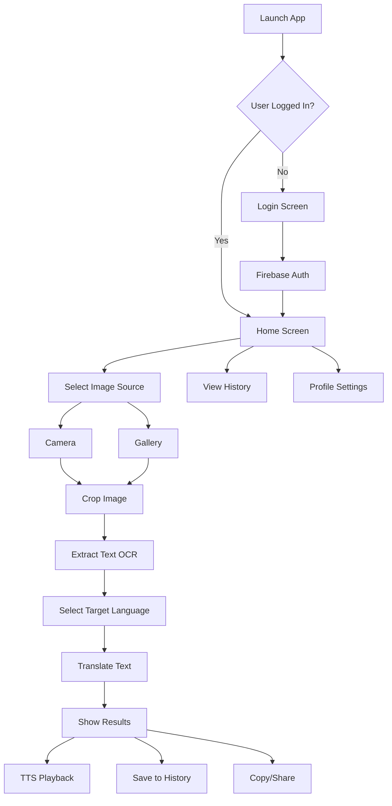

# 📱 OCR Translation App


[](https://android.com)
[](https://kotlinlang.org)
[](https://firebase.google.com)
[](https://cloud.google.com/translate)

A powerful Android application that combines **Optical Character Recognition (OCR)** with **multilingual translation** capabilities. Capture text from images and translate it into any language with ease!
*Developed during internship at TPCODL (Tata Power Central Odisha Distribution Ltd),Bhubaneswar*
## ✨ Features

### 🔐 **Authentication**
- Secure user login using **Firebase Authentication**
- Google Sign-In integration
- User profile management

### 📸 **Image Processing**
- **Camera capture** for real-time text extraction
- **Gallery selection** for existing images
- **Advanced image cropping** with intuitive controls
- High-quality image preprocessing for better OCR accuracy

### 🔍 **OCR Technology**
- **ML Kit Text Recognition** for accurate text extraction
- Support for multiple text formats and fonts
- Real-time text detection and extraction

### 🌍 **Translation**
- **Google Translate API** integration
- Support for **100+ languages**
- Instant translation with high accuracy
- Preserve formatting and context

### 🗣️ **Text-to-Speech (TTS)**
- Listen to translated text
- Multiple voice options
- Adjustable speech rate and pitch

### 📚 **History Management**
- **View History** - Browse all your translations
- **Cloud Storage** - Data synced with Firestore
- **Copy & Share** - Easy text sharing functionality
- **Search & Filter** - Find specific translations quickly

### 👤 **Profile & Settings**
- **Dark/Light Mode** toggle
- **Edit Profile** - Update user information
- **Clear History** - Remove all translation records
- **Logout** functionality
- Personalized user experience

## 🏗️ **Architecture**

```
┌─────────────────┐    ┌─────────────────┐    ┌─────────────────┐
│   Presentation  │    │    Business     │    │      Data       │
│                 │    │                 │    │                 │
│ • Compose UI    │◄──►│ • ViewModels    │◄──►│ • Firebase      │
│ • Navigation    │    │ • Use Cases     │    │ • ML Kit        │
│ • Themes        │    │ • Repositories  │    │ • Google APIs   │
└─────────────────┘    └─────────────────┘    └─────────────────┘
```

## 🛠️ **Tech Stack**

### **Frontend**
-  **Kotlin** - Primary language
-  **Jetpack Compose** - Modern UI toolkit
-  **Material Design 3** - UI components

### **Backend & Services**
-  **Firebase Suite**:
    - 🔐 **Authentication** - User management
    - 🗄️ **Firestore** - NoSQL database
    - 💾 **Storage** - File storage
    - 📊 **Analytics** - Usage tracking

### **AI & ML**
-  **Google ML Kit** - Text recognition
-  **Google Translate API** - Translation service

### **Core Libraries**
- **Navigation Compose** - Screen navigation
- **Coroutines** - Asynchronous programming
- **DataStore** - Local data persistence
- **OkHttp** - Network requests
- **Image Cropper** - Advanced image editing

## 📋 **Prerequisites**

- **Android Studio** Arctic Fox or later
- **Android SDK** API level 24+
- **Google Services** account
- **Firebase** project setup
- **Google Cloud** account (for Translate API)

## 🚀 **Getting Started**

### 1. **Clone Repository**
```bash
git clone https://github.com/yourusername/ocr-translation-app.git
cd ocr-translation-app
```

### 2. **Firebase Setup**
1. Create a new project in [Firebase Console](https://console.firebase.google.com)
2. Add Android app with package name: `com.example.imagetotext`
3. Download `google-services.json`
4. Place it in `app/` directory
5. Enable **Authentication**, **Firestore**, and **Storage**

### 3. **Google Translate API**
1. Go to [Google Cloud Console](https://console.cloud.google.com)
2. Enable **Cloud Translation API**
3. Create API credentials
4. Add API key to your project

### 4. **Build & Run**
```bash
# Sync project dependencies
./gradlew sync

# Build debug APK
./gradlew assembleDebug

# Install on connected device
./gradlew installDebug
```

## 📱 **App Flow**



## 🔧 **Configuration**

### **Firebase Configuration**
```kotlin
// app/build.gradle.kts
plugins {
    id("com.google.gms.google-services")
}

dependencies {
    implementation(platform("com.google.firebase:firebase-bom:33.15.0"))
    implementation("com.google.firebase:firebase-auth-ktx")
    implementation("com.google.firebase:firebase-firestore-ktx")
    implementation("com.google.firebase:firebase-storage-ktx")
}
```

### **ML Kit Setup**
```kotlin
dependencies {
    implementation("com.google.mlkit:text-recognition:16.0.0")
}
```

## 🎨 **Screenshots**

| Login Screen | Home Screen | OCR Results | Translation |
|:------------:|:-----------:|:-----------:|:-----------:|
|  |  |  |  |

| History | Profile | Dark Mode | Settings |
|:-------:|:-------:|:---------:|:--------:|
|  |  |  |  |

## 🌟 **Key Features Breakdown**

### 📸 **Smart Image Capture**
- Real-time camera preview
- Auto-focus and flash control
- Gallery integration with filtering
- Advanced cropping with gesture controls

### 🔍 **Intelligent OCR**
- Multi-language text detection
- Handwriting recognition support
- Document structure preservation
- Confidence scoring for accuracy

### 🌐 **Comprehensive Translation**
- 100+ supported languages
- Context-aware translations
- Batch translation support
- Offline language packs (future feature)

### 📊 **Rich History Management**
- Chronological sorting
- Search and filter options
- Export functionality
- Cloud synchronization

## 🎯 **Future Enhancements**

- [ ] **Offline Translation** - Work without internet
- [ ] **Batch Processing** - Multiple images at once
- [ ] **PDF Export** - Save translations as PDF
- [ ] **Widget Support** - Quick access from home screen
- [ ] **Voice Input** - Speak to translate
- [ ] **AR Translation** - Real-time camera overlay
- [ ] **Collaboration** - Share projects with others

## 🤝 **Contributing**

We welcome contributions! Please follow these steps:

1. **Fork** the repository
2. **Create** a feature branch (`git checkout -b feature/amazing-feature`)
3. **Commit** your changes (`git commit -m 'Add amazing feature'`)
4. **Push** to branch (`git push origin feature/amazing-feature`)
5. **Open** a Pull Request

## 📄 **License**

This project is licensed under the **MIT License** - see the [LICENSE](LICENSE) file for details.

## 📞 **Support**

- 📧 **Email**: dipsitarout@gmail.com
- 🐛 **Issues**: [GitHub Issues](https://github.com/yourusername/ocr-translation-app/issues)
- 📖 **Wiki**: [Documentation](https://github.com/yourusername/ocr-translation-app/wiki)
- 💬 **Discord**: [Community Chat](https://discord.gg/ocrtranslator)

## 🏆 **Acknowledgments**

- **Google ML Kit** for OCR capabilities
- **Firebase** for backend services
- **Material Design** for UI components
- **Open Source Community** for libraries and tools

---

<div align="center">

**Made with ❤️ by Dipsita Rout**

[](https://github.com/yourusername)
[](https://github.com/yourusername/ocr-translation-app)
[](https://github.com/yourusername/ocr-translation-app)

</div>